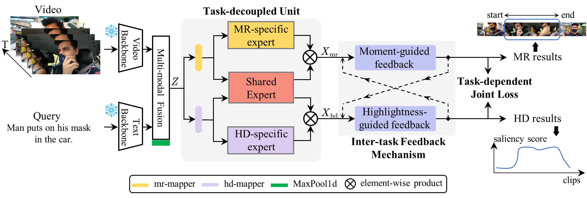
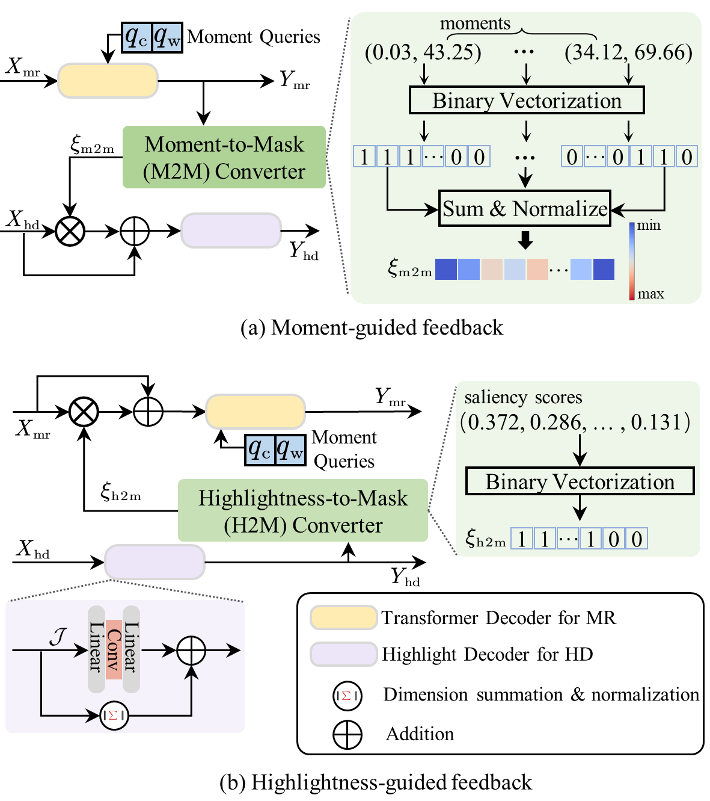

[CVPR 2024 Accepted] Task-Driven Exploration: Decoupling and Inter-Task Feedback for Joint Moment Retrieval and Highlight Detection

# Task-Driven Exploration: Decoupling and Inter-Task Feedback for Joint Moment Retrieval and Highlight Detection

[Arxiv](https://arxiv.org/abs/2404.09263)
### Introduction
This code repo implements TaskWeave in _CVPR 2024_, the first attempt to explore the task-driven paradigm for joint Moment Retrieval and Highlight Detection. In this paper, we present the first task-driven top-down framework, named TaskWeave. We introduce a task-decoupled unit to capture task-specific and common representations. To further investigate the interactions between these two tasks, we propose an inter-task feedback mechanism. It transforms the results of one task into guiding masks to assist the other task. Lastly, different from existing methods, we present a task-dependent joint loss function to optimize the model. As far as we are aware, this is the first framework to address this joint task from the task-centric perspective. Comprehensive experiments and in-depth ablation studies on QVHighlights, TVSum, and Charades-STA datasets corroborate the effectiveness and flexibility of the proposed framework.



### Data Preparation/Installation/More Details
Please refer to [MomentDETR](https://github.com/jayleicn/moment_detr) for more details.
Please refer to [UMT](https://github.com/TencentARC/UMT) for more details.
Please refer to [QD-DETR](https://github.com/wjun0830/QD-DETR) for more details.

### Training and Evaluation
- Train(Take `QVHighlights` as an example)
```python 
bash taskweave/scripts/train.sh 
bash taskweave/scripts/train_audio.sh 
```
- Evaluation (Take `QVHighlights` as an example)
```python
bash taskweave/scripts/inference.sh results/{direc}/model_best.ckpt 'val'
bash taskweave/scripts/inference.sh results/{direc}/model_best.ckpt 'test'
```

### References
If you are using our code, please consider citing the following paper.

```
@InProceedings{Yang_2024_CVPR,
    author    = {Yang, Jin and Wei, Ping and Li, Huan and Ren, Ziyang},
    title     = {Task-Driven Exploration: Decoupling and Inter-Task Feedback for Joint Moment Retrieval and Highlight Detection},
    booktitle = {Proceedings of the IEEE/CVF Conference on Computer Vision and Pattern Recognition (CVPR)},
    month     = {June},
    year      = {2024},
    pages     = {18308-18318}
}
```

#### The implementation of this code is built upon [MomentDETR](https://github.com/jayleicn/moment_detr) and [QD-DETR](https://github.com/wjun0830/QD-DETR), and we would like to express gratitude for the open-source contribution of [MomentDETR](https://github.com/jayleicn/moment_detr), [QD-DETR](https://github.com/wjun0830/QD-DETR) and [UMT](https://github.com/TencentARC/UMT).
